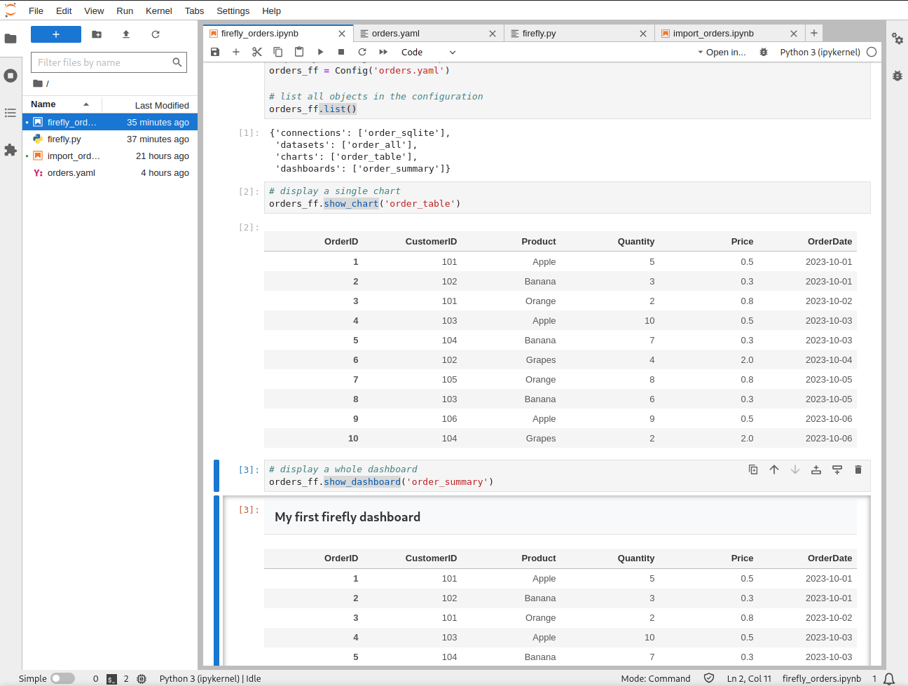

# Motivation

Firefly represents my initiative to streamline Business Intelligence (BI) by adopting a more declarative, low-code, "everything-as-code" approach, something I believe is missing in the current BI landscape. I call this concept **reporting as code**. My key requirements are:

- Modern, visually appealing design.
- Flexibility to build any report.
- User-friendly for both engineers and end-users.
- Easily reviewable by team members.
- Seamlessly deployable.
- Version-controlled via Git.
- Fast time to market.
- Simple to develop locally.
- Strong emphasis on data quality.

While Superset shows promise, it is not without its limitations. It is highly UI-centric, which often limits its usability for engineers who prefer code-driven workflows. The goal is to shift the focus toward a more code-centric approach to reporting.

# POC Scope

The concept is straightforward: develop an application to parse YAML files and generate reports without relying on a user interface. Ideally, the UI should be optional. By "report," I mean we need to handle the following entities:

- Secret (sensitive data)
- Connection (database connection details)
- Dataset (query definition)
- Chart (data visualization)
- Dashboard (a combination of visualizations)

This is quite similar to Superset's functionality, but the objective is to enhance the code-driven reporting aspect.

# Configuration example

## .env

```
order_db=order.db
```

## order.yaml

```yaml
connections:
  - name: order_sqlite
    description: yet another DB connection
    type: alchemy
    config:
        url: "sqlite:///orders.db"
datasets:
  - name: order_all
    description: yet another dataset
    query: select * from "order"
    connection: order_sqlite
charts:
  - name: order_table
    description: yet another table
    type: table
    dataset: order_all
dashboards:
  - name: order_summary
    description: yet another dashboard
    widgets:
      - type: banner
        config: 
            text: My first firefly dashboard
      - type: chart
        config:
            chart: order_table
```

That's it. It should be enough to build a report.

# POC implementation

- Secrets will be stored in .env file.
- Connections will utilize SQLAlchemy.
- Datasets will be represented as Pandas dataframes.
- Charts and dashboards will be a mix of HTML and CSS.
- Jupyter Notebook will serve as the IDE for development.

# Playgroud

Download this repository and run:

```sh
docker-compose up -d --build
```

You can create a sqllite database/table using [this](http://localhost:8888/lab/workspaces/auto-q/tree/import_orders.ipynb) notebook.

In the [playgroud](http://localhost:8888/lab/workspaces/auto-q/tree/firefly_orders.ipynb) notebook you can see the following stages:

- Import a configuration (yaml file).
- List all imported items using *.list()* method.
- Fire *.show_chart('chart_name')* to display a single chart.
- Plus, *.show_dashboard('dashboard_name')* to see the whole dashboard.



# Road map

Library:

- [ ] Secrets support
- [x] SQL Alchemy connections
- [x] Pandas datasets
- [x] Table chart
- [x] Jupyter support
- [ ] Plain file support (csv)
- [ ] Add more charts (pie, bar, line, big number)
- [ ] Modular approuch to create/update charts
- [ ] Filter widget support
- [ ] Import validation
- [ ] Error handling
- [ ] Customizable widget layout system

Web client:

- [ ] DB to store items
- [ ] API to import configurations
- [ ] API to manage items
- [ ] UI to list all items
- [ ] UI to render items
- [ ] Cache management
- [ ] User management
- [ ] User auth support
- [ ] Permission management
- [ ] Exports
- [ ] Query editor
- [ ] Data quality
- [ ] Alerts
- [ ] Secret management
- [ ] UI contructor

